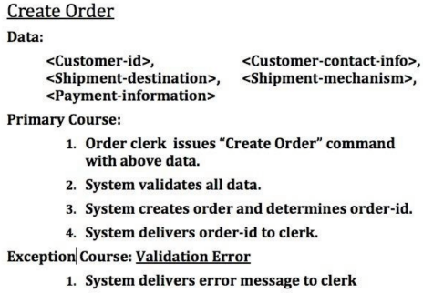
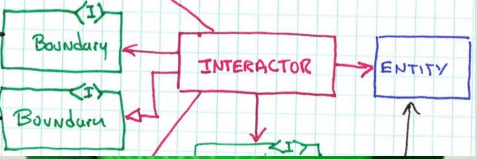
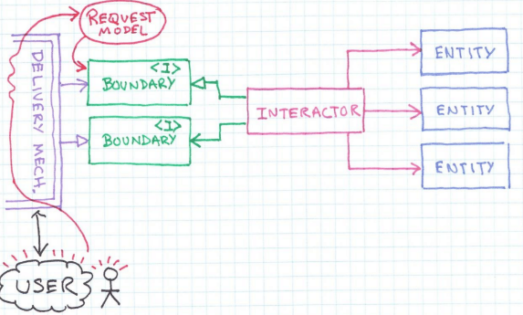
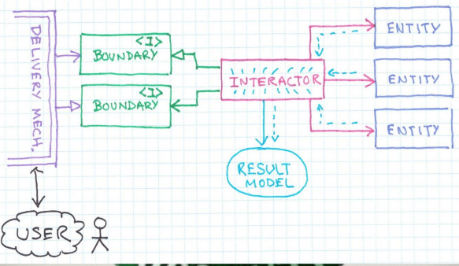
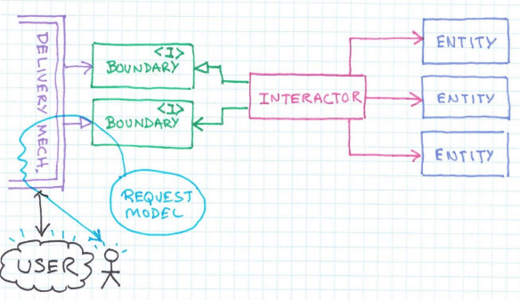
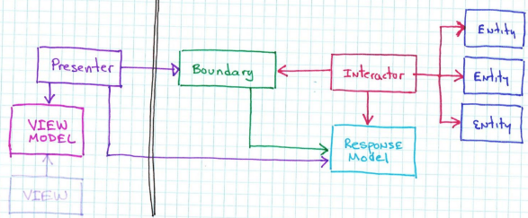
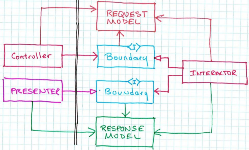

# ITkonekt 2019 | Clean Architecture and Design by Robert C. Martin (Uncle Bob) 

- Use cases are a simple description of one requirement. Specify input data, but there is no detailed information about it (high level abstraction). 

- Use case is an object, we can write the code for it, "abstract" code. ( Ivar Jacobson, Object-Oriented Software Engineering: A Use Case Driven Approach)

- The object that represent use case are called "iteractor". This kind of object have application specific business rules. (controll objects is the name that Jacobson gave for these objects).

There is two types of business rules:
1. Entity: Business rules that have nothing todo with automation. Business rules that the business would still use even if there are no computer. Application independent business rules.
2. Use Case: Business rules that are all about the automation.

- Boundaries Interfaces: In order get data in and out of the "use cases" lets work with boundaries.
  - Open arrow is a using relationship; 
    - OUTPUT BOUNDARY, this boundary is used by the interactor to delivery data;
  - Closed arrow is an inheritance relationship;   
    - INPUT BOUNDARY, accept data in and this boundary would be implemented by the interactor;

  - open to deliver and closed to accept

- Interactor coordinate the execution of entities, coordinate the acceptance of input and the delivery of output.

- Request Model: It is a data structure that is build from the data gathered by the "delivery mechanism". (Uncle bob calls it RAW DATA STRUCTURE). It is normally get passed into the interactor.

- Result Model: It is a data structure that is build from the result of the execution of the iteractor and the entitites of an application. 

- With this model of interaction, we can run thes on the "interactor" without any of the rest of the system running.

## Clean Model View Controll or Mocecl View Present

### Path for how the data get out for the web
1. Iteractor has created the reponse model.
2. Iteractor send he reponse model out through the output boundary (open arrow)
3. There is an object called Present that implements the output boundary. Its job is to take the data in the reponse model and reformat it so that it is displayable.
   1. Ex: If there is a date in the reponse model, it is just a date object. By the time the presenter gets this object, it will convert it into a string and put it in the view model.
   2. Ex2: If there is a money object in the reponse model, it is just a raw money object. By the time the presenter gets this object, it will convert it into a string with the bright decimal places and the right currency.
   3. Ex3: If there is buttons on the scream, the presenter will know the name of those buttons and will pute those names as strings into the view model.
   4. The present is responsible to made decisions about the screen.
   