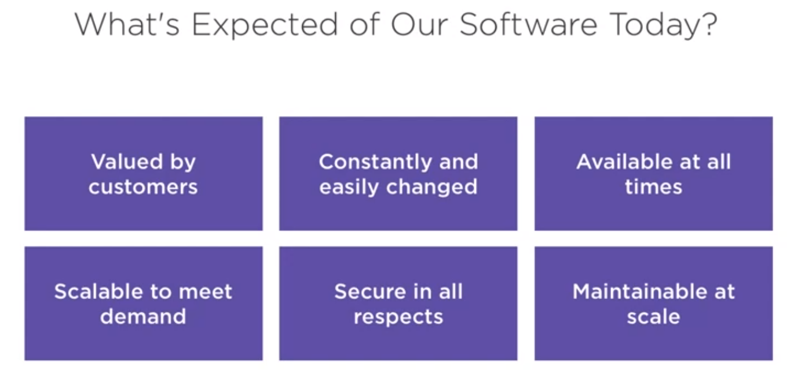
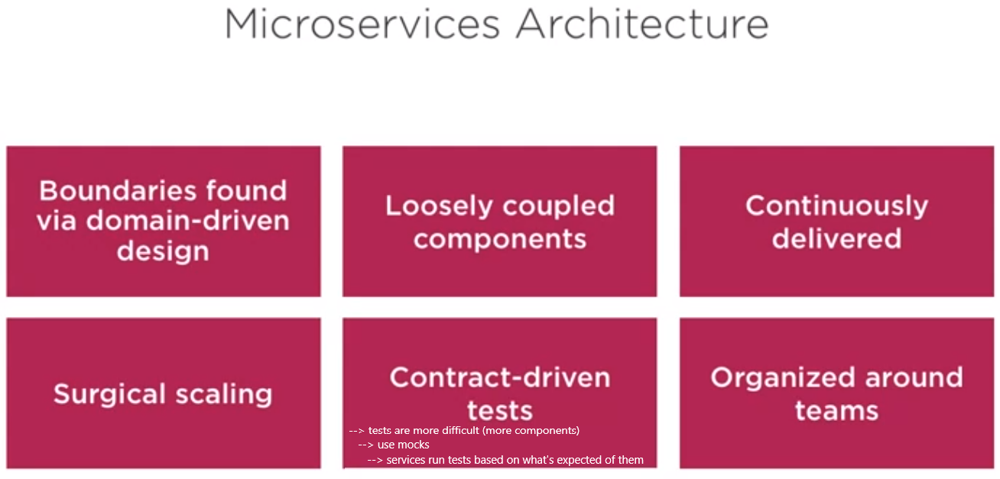
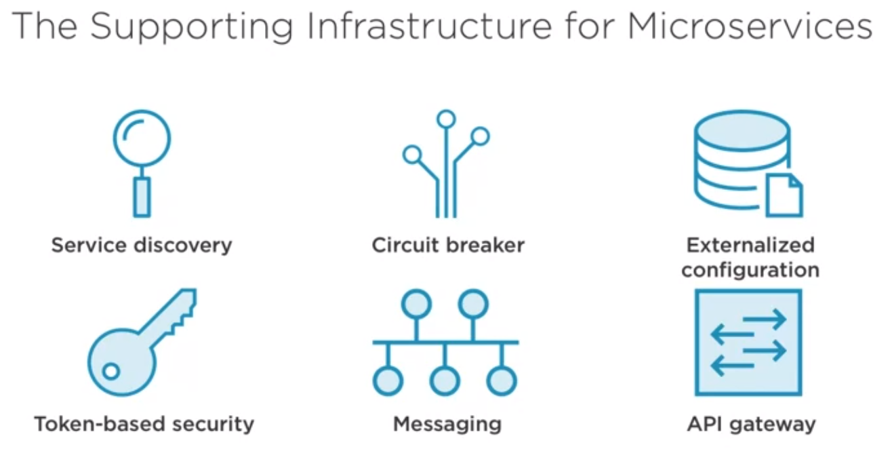

# Cloud-Native Architecture

## Defining "Cloud-Native"
> Cloud-native software is built for scale, built for continuous change, built to tolerate failure, built for manageability, 
> \- Richard Seroter

## What is Expected of Softwares Nowadays?

**Continuous delivery**: What is important to keep in mind is that cloud-native is not just about doing continuous delivery of code. It is about delivering the entire system **from infrastructure to applications to data and so forth** quickly, reliably more securely.

## Microservices Architecture
**Definition:** An architectural pattern of building small domain bounded and independently deployable services that communicate over a lightweight API

A common practice is to have microservices communicating via JSON over RESTful APIs

### The Supporting Infrastructure For Microservices

## Cloud-native Application Architeture

## Cloud-native Application delivery

## Cloud-native Application Infrastructure

## Cloud Abstractions
“As-a-service” generally means a service that is provided by a second party so that you can focus on what’s more important to you, like your code and relationships with your customers. 

### SaaS - Software as a Service
Software as a service (SaaS) allows users to connect to and use cloud-based apps over the Internet (e.g email, google services).

### PaaS - Platform as a Service
**Application-centric, integrated runtime**. No need to assemble an application stack, it is took for granted by the platform's users. Computing platforms typically includes operating system, programming language execution environment, database, web server etc.

Primarily for developers and programmers, a PaaS allows the user to develop, run, and manage their own apps without having to build and maintain the infrastructure or platform usually associated with the process.

**Example:** Heroku

### IaaS - Infrastructure as a Service
Infrastructure on demand. Provides computing infrastructure, the user manages things like the operating system, apps, and middleware while the provider takes care of any hardware, networking, hard drives, storage, and servers, and has the responsibility of taking care of outages, repairs, and hardware issues

The consumer has full control over the VM and has to maintain Patching, Software Updates, Security, etc.

**Examples:** Amazon EC2, Windows Azure, Rackspace, Google Compute Engine.

### CaaS - Container as a Service
Computing that lets users deploy and manage applications through container-based abstraction. The provider offers the framework, or the orchestration platform, on which the containers are deployed and managed, and it’s through this orchestration that key IT functions are automated. 

#### Containers Benefits
containers has many benefits: 

1. **Portability**: Apps developed in containers have everything they need to run and can be deployed in multiple environments,. Portability means flexibility because workloads can be move easily between environments and providers. 
2. **Scalability**: Containers have the ability to scale horizontally, meaning a user can multiply identical containers within the same cluster to expand when needed. By using and running only what is needed when it is needed, the costs can be reduced dramatically. 
3. **Efficiency**: Containers require fewer resources than virtual machines (VMs) **since they don’t need a separate operating system**. Run several containers on a single server requires less bare-metal hardware, which means lower costs.
4. **Increased security**: Containers are isolated from each other, which means if one container is compromised, others won’t be affected. 
5. **Speed**: Because of their autonomy from the operating system, starting and stopping a container is a matter of seconds. This also allows for faster development and operational speed, as well as a faster, smoother user experience.

### FaaS - Function-as-a-Service
**Pay-per-use code execution**. Function-as-a-Service is an event-driven computing execution model that runs in stateless containers. It allows developers to build, run, and manage those application packages as functions without having to maintain their own infrastructure.

By being an event-driven computing model, it’s there when you need it but it doesn’t require any server processes to be running constantly in the background, like platform-as-a-service (PaaS) would. 

FaaS is a way to implement serverless computing where developers write business logic that is then executed in Linux containers fully managed by a platform.

**Example:** AWS Lambda or Google Cloud Functions

## References
[Microsoft - what is paas ?](https://azure.microsoft.com/en-us/overview/what-is-paas/)
[RedHad - what is paas ?](https://www.redhat.com/en/topics/cloud-computing/what-is-paas)
[RedHad - what is caas ?](https://www.redhat.com/en/topics/cloud-computing/what-is-caas)
[what-is-saas-paas-and-iaas-with-examples](https://stackoverflow.com/questions/16820336/what-is-saas-paas-and-iaas-with-examples)
