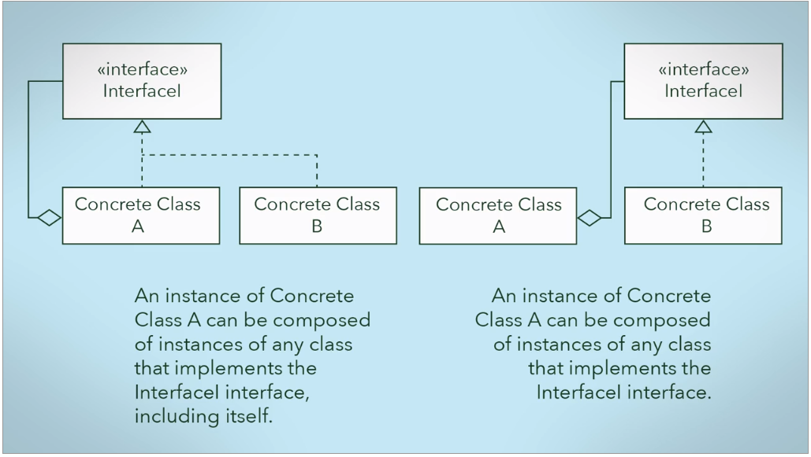

# Composing Objects Principle
Composing Objects Principle states that **classes should achieve code reuse through aggregation and delegation rather than inheritance.**
* Provide means of code reuse withoud the tight coupling of inharitance
* Independency among the compose classes since they don't share attributes or implementations of behaviours and operates separately. 
* Dynamically change the behaviour of objects at run time achieved by composing objects. In inheritance case, the behaviours are defined during the compiled time, which means that while the programm is running it cannot change how they behave.

**Disadvantages**
The biggest drawback of the composition is that the implementations must be provided implementations for all behaviour without be benefit of inheritance to share code. Meaning that might exist similar implementations across classes.

## References
http://www.blackwasp.co.uk/lsp.aspx
