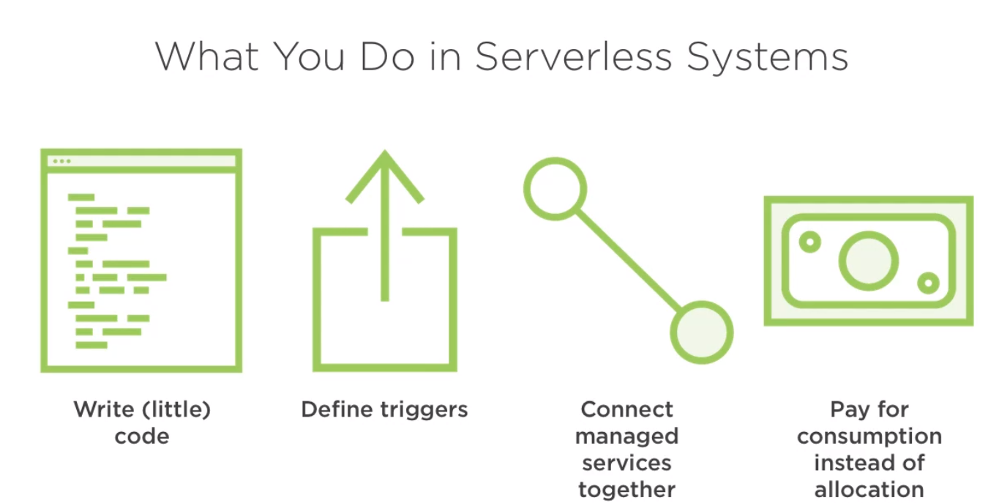

# Serveless Computing - The Big Picture

## Definitions
 > Refering to a cloud-computing execution model in which the cloud provider runs the server, and dynamically manages the allocation of machone resources.
> \- Wikipedia.org

> A serverless solution is one that costs you nothing to run if nobody is using it
> \- Paul D. Johnston

> A serverless solution is an event driven, utility, based, stateless, code execution environment in which you write code and consume services
> \- Simon Wardley

## What to do with lambda

## What You _DO NOT_ Do in Serverless Systems

## Serverless Paradigms

* You are only responsible for your application itself. Infrastructure is fully managed
* Your Architecture depends on events and **stateless** computing
* When nothing's happening, you pay nothing
* When something does happen, you have fine-grained billing visibility

## Serverless Vs Serverful

## Challenges 
### FaaS Needs Managed Services
- A function on its own is not of much value. It needs services to authenticate users, route requests, store information, and so on. 
- FaaS alone may increase complexity. Transform a current system that was, for example, five services and turn that into 150 different functions there will be a enormous increase of management, difficult to debug, trace and trobleshoot.
- Serveless != FaaS -> It is possible to build serveless solutions that do not include Function as a Service. Also, non-Serveless applications can be built using Function as a Service if there is a misuse of the platform and bad patterns.
- Non-managed services, such as data-bases, often not optimized for FaaS platforms. Maybe you face problems with non-managed services that do not perform well when there are hundreds of short-lived connections, because it may expect a long-lived connection, 

### Limited Lifetime Of Functions
- An instance of a function is short-lived
- Startup involves layers of latency (cold starts)
- Batch jobs must conclude in a short time window, because functions has limited lifetime

### Dependency on Remote Storage
- "Storage" may be from blob, cache, database, or event broker, because these functions does not keep any information afte its execution
- Any state used by function must be external
- Need to write to slow storage and read back in every instance

###  Vendor Lock-in
- Inspite of the code is portable, the architecture always isn't. Usually, the architecture is ver tightly woven into a bunch of managed services offered by that provider

## Serveless Use Caes

## Cloud Abstractions
“As-a-service” generally means a service that is provided by a second party so that you can focus on what’s more important to you, like your code and relationships with your customers. 

### SaaS - Software as a Service
Software as a service (SaaS) allows users to connect to and use cloud-based apps over the Internet (e.g email, google services).

### PaaS - Platform as a Service
**Application-centric, integrated runtime**. No need to assemble an application stack, it is took for granted by the platform's users. Computing platforms typically includes operating system, programming language execution environment, database, web server etc.

Primarily for developers and programmers, a PaaS allows the user to develop, run, and manage their own apps without having to build and maintain the infrastructure or platform usually associated with the process.

**Example:** Heroku

### IaaS - Infrastructure as a Service
Infrastructure on demand. Provides computing infrastructure, the user manages things like the operating system, apps, and middleware while the provider takes care of any hardware, networking, hard drives, storage, and servers, and has the responsibility of taking care of outages, repairs, and hardware issues

The consumer has full control over the VM and has to maintain Patching, Software Updates, Security, etc.

**Examples:** Amazon EC2, Windows Azure, Rackspace, Google Compute Engine.

### CaaS - Container as a Service
Computing that lets users deploy and manage applications through container-based abstraction. The provider offers the framework, or the orchestration platform, on which the containers are deployed and managed, and it’s through this orchestration that key IT functions are automated. 

#### Containers Benefits
containers has many benefits: 

1. **Portability**: Apps developed in containers have everything they need to run and can be deployed in multiple environments,. Portability means flexibility because workloads can be move easily between environments and providers. 
2. **Scalability**: Containers have the ability to scale horizontally, meaning a user can multiply identical containers within the same cluster to expand when needed. By using and running only what is needed when it is needed, the costs can be reduced dramatically. 
3. **Efficiency**: Containers require fewer resources than virtual machines (VMs) **since they don’t need a separate operating system**. Run several containers on a single server requires less bare-metal hardware, which means lower costs.
4. **Increased security**: Containers are isolated from each other, which means if one container is compromised, others won’t be affected. 
5. **Speed**: Because of their autonomy from the operating system, starting and stopping a container is a matter of seconds. This also allows for faster development and operational speed, as well as a faster, smoother user experience.

### FaaS - Function-as-a-Service
**Pay-per-use code execution**. Function-as-a-Service is an event-driven computing execution model that runs in stateless containers. It allows developers to build, run, and manage those application packages as functions without having to maintain their own infrastructure.

By being an event-driven computing model, it’s there when you need it but it doesn’t require any server processes to be running constantly in the background, like platform-as-a-service (PaaS) would. 

FaaS is a way to implement serverless computing where developers write business logic that is then executed in Linux containers fully managed by a platform.

**Example:** AWS Lambda or Google Cloud Functions

## Serverless Best Practices
- Create Single purpose functions
	- Keep each function's scope small
	- If there is lots of branching (several if-elses statements, switches, conditions) -> REFACTOR, break it into small functions
- Use Intermediaries for cross-function Communication
	- Avoid function-to-function invocations
	- Use storage or queues to transfer work or events
	- Encourages loose-coupling and composable systems
- Limit Dependent Packages
	- Morer dependencies often means slower startup time (increases the cold start)
- Create Idempotent Functions 
	- Want the same result if function invoked multiple times
	- Supports partial failure cases, pr FaaS platform auto-retries
- Avoid Connections-based systems 
	- Reconsider integrating with software that uses persistent connections
	- Aim for neccting to cloud native service APIs
- Avoid Long-Running Functions
	- May experience unexpected timeouts if functions have potential for long lifecycle 
	- Refactor into smaller fnctionst that coordinate as needed
- Receive and Send Data in Batches
	- Better performance to instantiate function with batch data
	- Querying managed services in batch may also prove beneficial
	- Consider bandwidth charges, connection costs when deciding on a strategy
- Choose the right place for state
	- Serverveless system still have state. These states can be storaged in cache or database depending on need  
- Understand System Scaling Mechanisms
	- Recognize how FaaS scales out and any limits 
	- Run chaos and load experiments to uncover possible pain points
- Leverage built-in logging offered by Cloud Providers
	- Augment log messages with correlation tokens as needed 
- Continue Using CI/CD Processes 
 

## References
[Microsoft - what is paas ?](https://azure.microsoft.com/en-us/overview/what-is-paas/)
[RedHad - what is paas ?](https://www.redhat.com/en/topics/cloud-computing/what-is-paas)
[RedHad - what is caas ?](https://www.redhat.com/en/topics/cloud-computing/what-is-caas)
[what-is-saas-paas-and-iaas-with-examples](https://stackoverflow.com/questions/16820336/what-is-saas-paas-and-iaas-with-examples)
