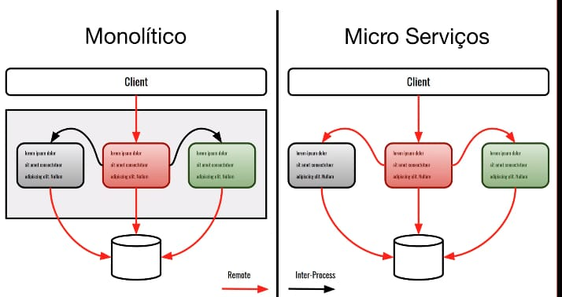

# Aula 1
 
 ## Monolith vs Microservices
 - *Escopo e Domínio*
     - A diferenciação entre Monolith e Microservices se da pelo escopo
     - Exemplo Domínios: "Usuários, transação, assinatura"
     - Monolith
         - Uma única aplicação atendendo muitos *Domínios/Serviços*
 - Monolith vs Microservices também é uma questão de "o quão *distribuida é a arquitetura*"
 - Exemplo: "Domínio de usuário"
 - BFF: Backend for Frontend
 

 ### Performance
 *Monolith > Microservices*, pois em Monolith as chamadas são locais; já em Microservices as chamadas são remotas e portanto há a latência maior
 
 ### Disponibilidade
 - Disponibilidade: "Ter uma resposta com sucesso, não significa só receber 200, mas sim uma mensagem interpretável"
 - *Monolith > Microservices*, pois há menos ponto de falha; 
 - *Monolith Drawbacks*
     - "Ficam indisponíveis, porque acaba recurso"
     - CPU, Mem, Disco
     - Pool conexões 
         - pode esgotar, quando isso ocorrer, timeouts começam a acontecer
 - *Microservices Drawbacks*
     - Network
 
 ### Consistência
 - *Monilith > Microservices*
 - *Microservices Drawbacks*
     - Alta complexidade para "desfazer" as coisas em uma arquitetura de microservices (atomicidade) por conta das chamadas remotas
     - O monolith por não ser uma chamada remota (são chamadas locais), faz uso de transações para realizar as operações, caso um problema ocorra, é possivel fazer o rollback da transação
 
 ### Segurança
 - *Monolith <> Microservices*
 - Microservices
     - O limite de acesso as funções do sistema é definido pelas permissões de acesso que um microservice possui
 - Monolith
     - O limite de acesso as funções do sistema é definido por todas  as funções que estão presentes no monolith
 - Hacker consegue acesso máquina de um microservice que se comunica com outro microservice que não expoem endpoint publico. Dependendo do micro-service é perigoso
 
 ### Escalabilidade
 - 
 
 ## Falácias de Sistemas Distribuídos
 - A rede é confiável
     - Hardware e software podem ter problemas
     - Como tratar o timeout? (é a situação de *no answer*)
     - Dados podem ser perdidos quando transferidos via rede
 - Latência de rede é *Zero*
 - A largura de banda é infinita
     - apesar da largura de banda aumentar, a quantidade de dados aumenta também
     - quando transfere  muitos dados em pequeno intervalo de tempo, congestionamento da rede pode interferir
     - ORMs eargerly fetching pode consumir muitos dados
     - muito metadado é transferido na rede (consome banda também!!)
 - A rede é segura
 - A topologia não muda
 - Há somente um administrador
 - Custo de transporte é zero
     - Serialização e deserialização consome CPU e portanto há gastos quando realizamos o transporte da informação
 - A rede é homogênea
 
 ## Two Fase Commit
 
 ## Qual o problema das procedures de banco?
 - Devido a sua limitação de utilização dos recursos do banco de dados (memória, CPU), por isso, normalmente, é escolhido não mover parte da lógica da aplicação para procedures de banco, justamente por conta da utilização 'extra' dos recursos do banco, o que é mais complicado de escalar.