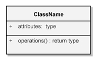
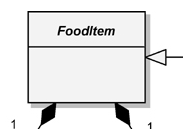
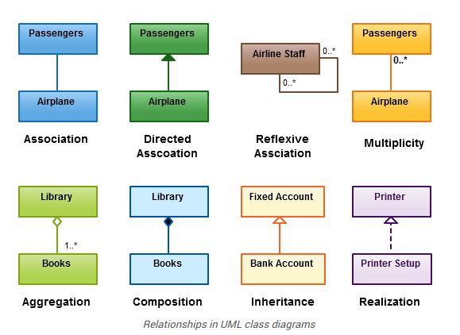
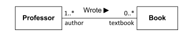
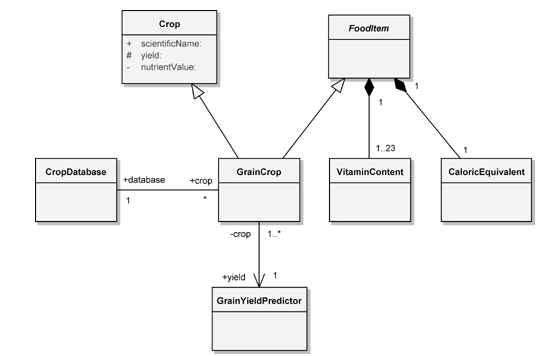
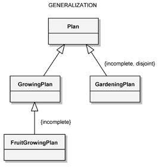
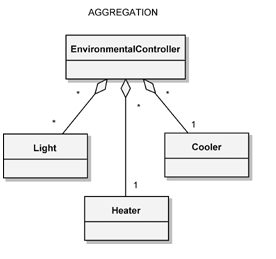
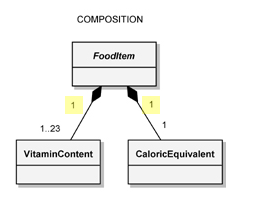

# UML Class Diagrams
- The UML Class Diagrams can be used to show the existence of classes and their relationships in the logical view of a system.
- The class diagrams, **during analysis**, can be used to **indicate the common roles and responsibilities of the entities** that provide the system's behavior
- The class diagrams, **during design**, is used to capture the structure of the classes that form the system's arc.
- The essestial elements of a class diagram are:
    - classes
    - relationships

## UML Diagrams

## Class Notation
- A name is required for each class and must be unique to its enclosing namespacec
- Attribute specification format: `visibility attributeName : Type [multiplicity] = DefaultValue {property string}`
- Operation specification format: `visibility operationName (parameterName : Type) : ReturnType {property string}`

 

- It is useful to expose **some** of the attributes and operations associated with a class. **There is no need to show all the attributes and operations**. In this sense, the attributes and operations that are shown represent an elided view of the class's entire specification, which serves as the single point of declaration for all of its members. 

### Abstract Class Adornment
- The name of an abstract class is italicized. Similarly, to denote that an operation is abstract, its operation name is italicized as well.

## Class Relationships
- The essential connections among classes include association, generalization, aggregation, and composition.

image reference: [creately](https://creately.com/blog/diagrams/class-diagram-relationships/)

 

- Each relationship may include a textual label that document the name of the relationship or the association ends may have textual label as well to indicate the roles of an association
    - https://www.uml-diagrams.org/association.html

image reference: [uml-diagrams.org](htttps://www.uml-diagrams.org/association.html)

> Association **Wrote** between Professor and Book
> 
> with association ends **author** and **textbook**.

- **Wrote** is a name direction property and it specifies the direction in which an association's name should be read ([reference](https://support.ptc.com/help/modeler/r9.1/en/index.html#page/Integrity_Modeler/rtsme/ref_prop_name_direction.html#wwID0E6L4Y)).

- A class may have an association to itself (called a reflexive association)
- Generalization, aggregation and composition are drawn as **refinements** of the more general association icon. 
  - During the first moments of the analysis, first, is asserted the existence of a semantic connection between two classes and then, as tactical decisions are made about the nature of their relationship, often is refined into Generalization, aggregation or composition

### Multiplicity
- `1` Exactly one
- `*` Unlimited number (zero or more)
- `0..*` Zero or more
- `1..*` One or more
- `0..1` Zero or one
- `3..7` Specified range (from three through seven, inclusive)
- The multiplicity notation is **applied to the target end of an association** and denotes the number of links between each instance of the source class and instances of the target class.

### Association Directionality

image reference: Booch, G. et al. Object-Oriented Analysis and Design with Applications

> During analysis we regard associations as bidirectional logical connections between analysis classes. During design we turn our focus to issues such as navigability of an association. The unidirectional association from the GrainCrop class to the GrainYieldPredictor class typically means that some method of GrainCrop uses the services of GrainYieldPredictor in its implementation.
>
> \- Booch, G. et al. Object-Oriented Analysis and Design with Applications
### Generalization
- The generalization icon denotes a generalization/specialization relationship 
    - The "is a" relationship
- appears as an association with a **closed arrowhead** that points to the _superclass_ (the opposite end of the association designates the subclass)

image reference: Booch, G. et al. Object-Oriented Analysis and Design with Applications

### Aggregation
- is the "part of" relationship
- The aggregation icon denotes a whole/part hierarchy and also implies the ability to navigate from the aggregate to its parts
- Appears as an association with an **unfilled diamond** at the end denoting the aggregate (the whole)

image reference: Booch, G. et al. Object-Oriented Analysis and Design with Applications
### Composition
- The composition icon denotes a containment relationship and appears as an association with a filled diamond at the end denoting the aggregate

> - The multiplicity at this end is 1 because the parts are defined as having no meaning outside the whole, which owns the parts; their lifetime is tied to that of the whole. The 
> 
> \- Booch, G. et al. Object-Oriented Analysis and Design with Applications

image reference: Booch, G. et al. Object-Oriented Analysis and Design with Applications

### Realization

### Dependency

- [TODO](https://stackoverflow.com/questions/26982886/uml-relationships-dashed-line-vs-solid-line)
- TODO PPT 8 - OO

### Visibility

- `Public (+)` Visible to any element that can see the class
- `Protected (#)` Visible to other elements within the class and to subclasses
- `Private (-)` Visible to other elements within the class
- `Package (~)` Visible to elements within the same package

#### Association Visibility
Association visibility can be denoted by placing these visibility symbols on the association end names to indicate access to the target end from the source end of the association. 

image reference: Booch, G. et al. Object-Oriented Analysis and Design with Applications

- The visibility of the association end names between the `GrainCrop` class and the `GrainYieldPredictor` class; `GrainCrop` is **private** to the `GrainYieldPredictor` class.

### **Association End** Names 

- A role denotes the purpose or capacity wherein one class associates with another.

### Qualifier
[READ](https://www.uml-diagrams.org/property.html)

## Reference
- https://www.google.com/search?q=Association+Classes+uml&oq=Association+Classes+uml&aqs=chrome..69i57.1820j0j7&sourceid=chrome&ie=UTF-8
- http://etutorials.org/Programming/UML/Chapter+6.+Class+Diagrams+Advanced+Concepts/Association+Class/
- https://www.uml-diagrams.org/association.html
- https://www.visual-paradigm.com/guide/uml-unified-modeling-language/uml-aggregation-vs-composition/
- https://stackoverflow.com/questions/2699210/association-name-direction-in-uml-use-case-diagram
- https://support.ptc.com/help/modeler/r9.1/en/index.html#page/Integrity_Modeler/rtsme/overview_of_associations.html
- https://support.ptc.com/help/modeler/r9.1/en/index.html#page/Integrity_Modeler/rtsme/ref_di_association.html#wwID0E4HHS
- https://support.ptc.com/help/modeler/r9.1/en/index.html#page/Integrity_Modeler/rtsme/ref_prop_name_direction.html#wwID0E6L4Y
- https://support.ptc.com/help/modeler/r9.1/en/index.html#page/Integrity_Modeler/rtsme/ref_di_role.html#wwID0EQJWV
- https://creately.com/blog/diagrams/class-diagram-relationships/
- https://www.ibm.com/docs/en/rational-soft-arch/9.5?topic=diagrams-qualifiers-association-ends
- https://stackoverflow.com/questions/67648635/what-is-an-association-end-in-uml
- https://stackoverflow.com/questions/18813549/association-owned-by-classifier-and-association-owned-by-relationship-in-uml
- https://www.google.com/search?q=association+class+in+a+class&oq=association+class+in++a+class&aqs=chrome..69i57j69i60l3.10811j0j7&sourceid=chrome&ie=UTF-8
- https://stackoverflow.com/questions/62094457/i-dont-understand-association-class-uml-class-diagram
- https://stackoverflow.com/questions/13443724/uml-how-to-implement-association-class-in-java
- https://stackoverflow.com/questions/67048791/uml-association-class-in-multiple-relations
- https://www.bouml.fr/
- https://wiki.c2.com/?AssociationClass
- https://knowhow.visual-paradigm.com/uml/association-class/
- https://github.com/AugustoCalado/Computer-Science-Concepts-Techniques-Technologies/tree/master/UML

